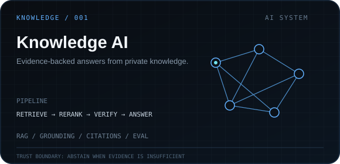
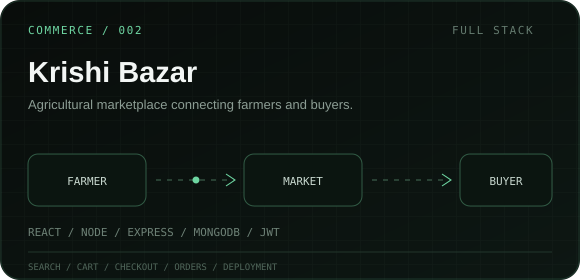
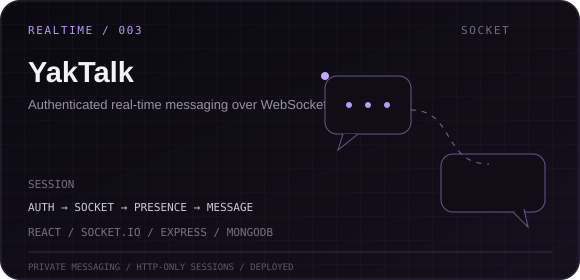
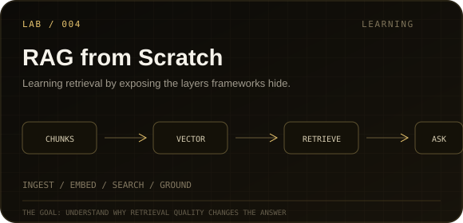
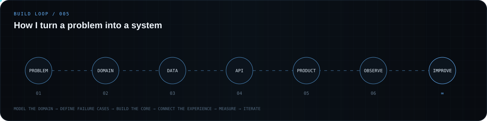
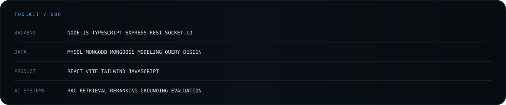
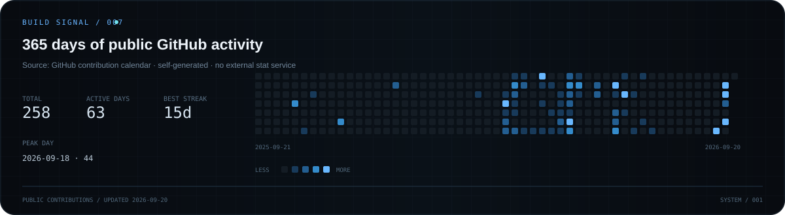
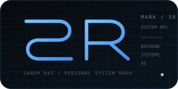

<p align="center">
  
</p>

<p align="center">
  <a href="https://sanam-rai.com.np"><b>PORTFOLIO</b></a>
  &nbsp;&nbsp;•&nbsp;&nbsp;
  <a href="https://www.linkedin.com/in/sanam-rai-6b2149212/"><b>LINKEDIN</b></a>
  &nbsp;&nbsp;•&nbsp;&nbsp;
  <a href="https://github.com/SanamRai001?tab=repositories"><b>REPOSITORIES</b></a>
</p>

<br/>

## `01 / PROFILE`

I’m a **backend-first full-stack developer** from Nepal. I enjoy the part of software engineering where an idea stops being a screen and starts becoming a **system** — domain rules, data models, APIs, failure cases, security boundaries, workflows, and the architecture that holds everything together.

I work across the stack when the product needs it, but I’m especially interested in **backend architecture, databases, real operational software, RAG, retrieval, grounding, and AI system design**.

> **Current principle:** build software that stays useful after the demo is over.

```text
SYSTEMS       APIs · architecture · databases · workflows
PRODUCTS      real users · real constraints · full-stack delivery
INTELLIGENCE  RAG · retrieval · grounding · evaluation · agents
```

<br/>

## `02 / SELECTED SYSTEMS`

<p align="center">
  <a href="https://github.com/SanamRai001/knowledge-ai">
    
  </a>
  <a href="https://github.com/SanamRai001/KrishiBazar">
    
  </a>
</p>

<p align="center">
  <a href="https://github.com/SanamRai001/YakTalk-chatapp">
    
  </a>
  <a href="https://github.com/SanamRai001/rag-from-scratch">
    
  </a>
</p>

<details>
<summary><b>Project notes</b></summary>
<br/>

**Knowledge AI** — a document-grounded assistant built around retrieval, reranking, evidence sufficiency, citations, abstention, graph/hierarchical retrieval experiments, multilingual queries, and evaluation tooling.

**Krishi Bazar** — a deployed agricultural marketplace with authentication, search/filter/sort, cart, checkout, orders, React, Node.js, Express, and MongoDB. [Live demo](https://krishi-bazar-alpha.vercel.app)

**YakTalk** — a real-time chat application with authenticated WebSocket connections, presence, private messaging, HTTP-only cookie sessions, React, Express, Socket.IO, and MongoDB. [Live demo](https://yaktalk-chatapp-1.onrender.com)

**RAG from Scratch** — a learning lab for understanding ingestion, chunking, embeddings, retrieval, similarity, grounding, and how retrieval quality changes generated answers.

</details>

<br/>

## `03 / BUILD LOOP`

<p align="center">
  
</p>

I care about **clear boundaries, useful documentation, honest failure handling, and architecture that can grow** without turning every new requirement into a rewrite.

<br/>

## `04 / TOOLKIT`

<p align="center">
  
</p>

<sub>
I choose tools based on the system, not the badge wall. The technologies above are the ones I currently reach for most often.
</sub>

<br/>

## `05 / BUILD SIGNAL`

<p align="center">
  
</p>

<sub>
Generated inside this repository from GitHub's public contribution calendar and refreshed automatically — no third-party stats card.
</sub>

<br/>

## `06 / CURRENT SIGNAL`

```text
AI / KNOWLEDGE
├─ trustworthy retrieval and citation systems
├─ hybrid search, reranking and grounding
├─ evaluation over "it feels good"
└─ agents with sensible human control

BACKEND / SYSTEMS
├─ domain modeling and API boundaries
├─ relational + document data design
├─ authentication, permissions and tenancy
└─ operational workflows that survive edge cases

LEARNING / DEPTH
├─ AI architecture from first principles
├─ system design and databases
├─ security fundamentals
└─ understanding why the abstraction works
```

<br/>

## `07 / FOUNDATIONS`

**Harvard CS50x** — Introduction to Computer Science  
**Harvard CS50P** — Introduction to Programming with Python  
**PortSwigger Web Security Academy** — SQL injection labs

<br/>

<p align="center">
  
</p>

---

<p align="center">
  <sub>SYSTEM / 001 — SANAM RAI</sub>
</p>

<h3 align="center">Build the system. Understand the system. Improve the system.</h3>

<p align="center">
  <a href="https://sanam-rai.com.np">Portfolio</a>
  &nbsp;·&nbsp;
  <a href="https://www.linkedin.com/in/sanam-rai-6b2149212/">LinkedIn</a>
  &nbsp;·&nbsp;
  <a href="https://github.com/SanamRai001">GitHub</a>
</p>
