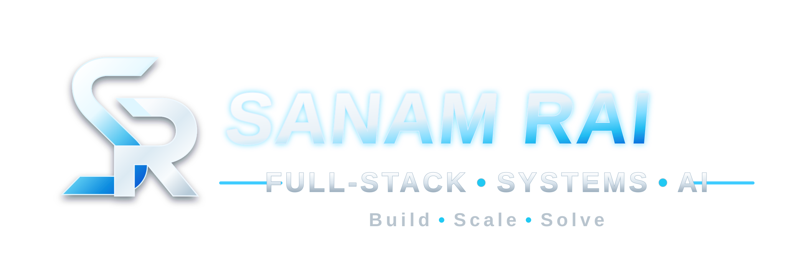
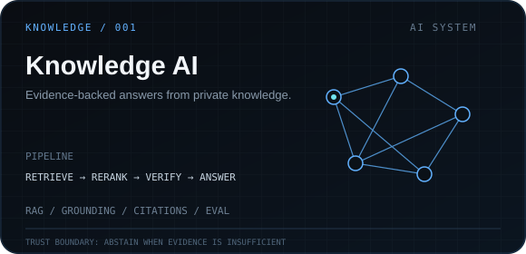
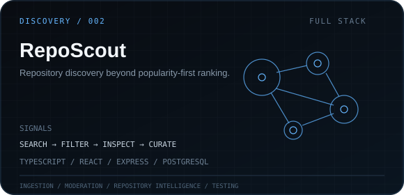
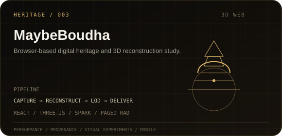
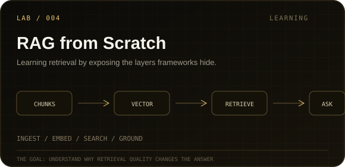
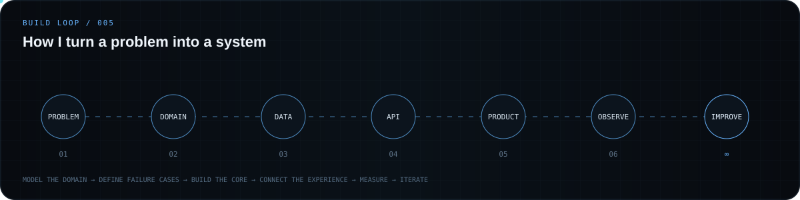
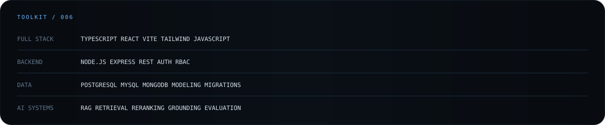
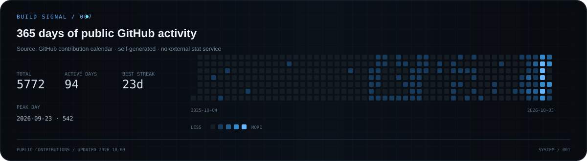
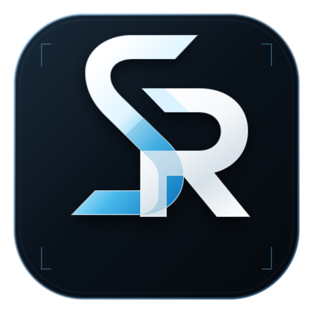
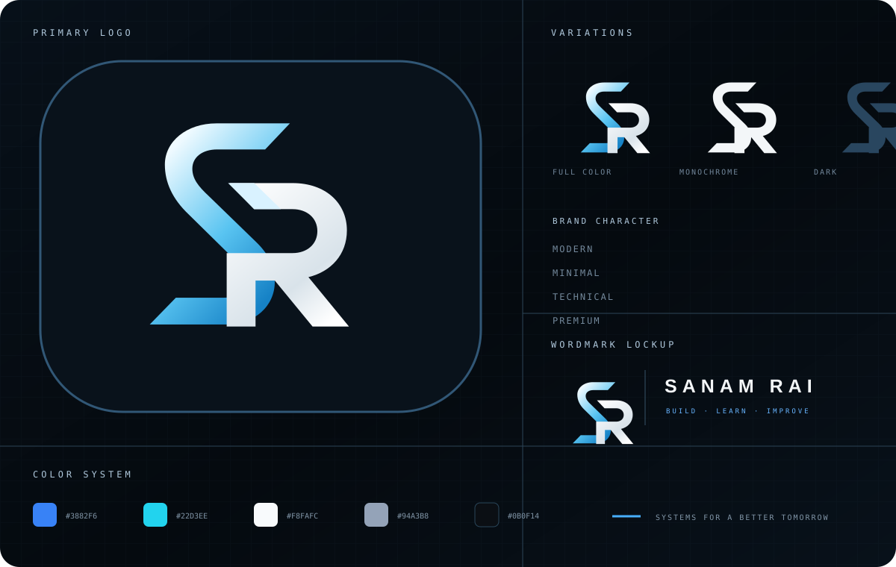

<p align="center">
  
</p>

<p align="center">
  <a href="https://sanam-rai.com.np"><b>PORTFOLIO</b></a>
  &nbsp;&nbsp;•&nbsp;&nbsp;
  <a href="https://www.linkedin.com/in/sanam-rai-6b2149212/"><b>LINKEDIN</b></a>
  &nbsp;&nbsp;•&nbsp;&nbsp;
  <a href="https://github.com/SanamRai001?tab=repositories"><b>REPOSITORIES</b></a>
</p>

<p align="center">
  
</p>

<br/>

## `01 / PROFILE`

I’m a **full-stack developer** from Nepal building real products across frontend, backend, APIs, databases, testing, and deployment.

I work mainly with **TypeScript/JavaScript, Node.js, React, PostgreSQL/MySQL, and REST APIs**. I enjoy working across the stack, but I’m especially interested in **backend architecture, authentication, database design, system design, security, and AI/LLM systems**.

> **Current principle:** make complex systems feel simple without hiding the engineering that makes them reliable.

```text
FULL STACK     product UI · APIs · data · delivery
SYSTEMS        architecture · auth · databases · workflows
INTELLIGENCE   RAG · retrieval · grounding · evaluation · agents
```

<br/>

## `02 / SELECTED SYSTEMS`

<p align="center">
  <a href="https://github.com/SanamRai001/knowledge-ai">
    
  </a>
  <a href="https://github.com/SanamRai001/reposcout">
    
  </a>
</p>

<p align="center">
  <a href="https://github.com/SanamRai001/MaybeBoudha">
    
  </a>
  <a href="https://github.com/SanamRai001/rag-from-scratch">
    
  </a>
</p>

<details>
<summary><b>Project notes</b></summary>
<br/>

**Knowledge AI** — a private company intelligence platform built around evidence-backed Ask, retrieval, citations, abstention, structured analytics, safe actions, watch rules, integrations, controlled automation, multi-tenancy, and production hardening.

**RepoScout** — a full-stack repository discovery and repository-intelligence platform using structured search, ingestion, moderation, repository signals, and PostgreSQL-backed discovery instead of popularity alone.

**MaybeBoudha** — an experimental browser-based digital-heritage project exploring Boudhanath reconstruction, Three.js/Spark rendering, point-cloud and surface experiments, progressive delivery, and mobile-aware presentation. [Live prototype](https://maybeboudha.run.place/)

**RAG from Scratch** — a learning lab for understanding chunking, embeddings, vector search, retrieval, grounding, and how retrieval quality changes generated answers.

</details>

<br/>

## `03 / BUILD LOOP`

<p align="center">
  
</p>

I care about **clear boundaries, useful documentation, honest failure handling, maintainable code, and architecture that can grow** without making the product harder to use.

<br/>

## `04 / TOOLKIT`

<p align="center">
  
</p>

<sub>
Tools change. I care more about choosing the right boundary, data model, failure behavior, and user flow than collecting technologies.
</sub>

<br/>

## `05 / BUILD SIGNAL`

<p align="center">
  
</p>

<sub>
Generated inside this repository from GitHub's public contribution calendar and refreshed automatically — no third-party stats card.
</sub>

<br/>

## `06 / LIVE SIGNAL`

<p align="center">
  
</p>

<sub>
Stars, followers, public repositories, and the most recently pushed public project — refreshed automatically from GitHub.
</sub>

<br/>

## `07 / CURRENT FOCUS`

```text
FULL-STACK / PRODUCT
├─ simple, accessible user flows
├─ frontend + backend integration
├─ testing and deployment
└─ production-oriented delivery

BACKEND / SYSTEMS
├─ domain modeling and API boundaries
├─ relational + document data design
├─ authentication, permissions and tenancy
└─ operational workflows that survive edge cases

AI / KNOWLEDGE
├─ trustworthy retrieval and citation systems
├─ hybrid search, reranking and grounding
├─ evaluation over "it feels good"
└─ agents with sensible human control
```

<br/>

## `08 / FOUNDATIONS`

**Harvard CS50x** — Introduction to Computer Science  
**Harvard CS50P** — CS50's Introduction to Programming with Python  
**PortSwigger Web Security Academy** — SQL injection labs

<br/>

## `09 / IDENTITY`

<p align="center">
  
</p>

<p align="center">
  <sub>SR / 001 · personal identity system</sub>
</p>

<details>
<summary><b>View brand identity board</b></summary>
<br/>

<p align="center">
  
</p>

</details>

<br/>

---

<p align="center">
  <sub>SYSTEM / 001 — SANAM RAI</sub>
</p>

<h3 align="center">Build · Scale · Solve</h3>

<p align="center">
  <a href="https://sanam-rai.com.np">Portfolio</a>
  &nbsp;·&nbsp;
  <a href="https://www.linkedin.com/in/sanam-rai-6b2149212/">LinkedIn</a>
  &nbsp;·&nbsp;
  <a href="https://github.com/SanamRai001">GitHub</a>
</p>
